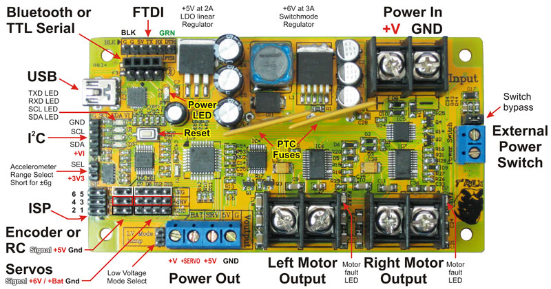

# DAGU T'Rex Motor Controller

The T’REX controller from DAGU is an Arduino compatible robot controller designed to power and control servos and brushed motors. Supplied sample code allows the controller to connect to a radio control receiver, external controller via I²C or optional bluetooth interface. A sample app allows the controller to be controlled by an Android phone or tablet.

The ATmega328P controller comes with the Arduino bootloader and customer software can be uploaded via the built in USB interface, ISP or FTDI sockets.

The Dual H bridges are rated for stall currents of 40A per motor and average currents of 18A per motor. Factory calibrated hall-effect sensors measure current draw of each motor. Each motor has independent variable electronic braking. Self-resetting PTC fuses prevent damage from stalled motors.

The built in switch mode power supply allows the controller to work over a wide range of voltages from 6V – 30V and delivers 3A of current @6V for driving servos. The 5V LDO regulator can deliver in excess of 2A if required for powering an external controller.

A built in 3-axis accelerometer provides robots with angle, acceleration and impact data.

The original information can be found at [http://www.dagurobot.com/Robot-Controller/RS036](http://www.dagurobot.com/Robot-Controller/RS036).

Features:

* 6V -30V operation with built in solid state power switch
* Programmable with the Arduino IDE (ATMega328P, 5V @ 16MHz)
* Dual FET “H” bridge rated 18A with self resetting PTC fuses
* Electronic braking and current monitoring for each motor
* 3-axis accelerometer provides angle and impact detection
* Auto-detects RC, BlueTooth, or I2C control
* Voltage translation on I2C interface
* 6x Servo Outputs

## Datasheet

The controllers datasheet can be found [here](./manual/TREX-robot-controller-instruction-manual1.pdf).

## Original Firmware

The original firmware has been included in this repository and can be compiled and flashed using Arduino IDE.

Just select `Arduino Nano` as the board and make sure the processor is set to `ATmega328P (Old Bootloader)`. Give it some time to start after flashing.